# RoleFlow — Comprehensive Enterprise Project Documentation
## Agentic AI-Powered Internal Talent Mobility Platform

**Document Version**: 1.2.0 (Enterprise Release)  
**Date of Publication**: September 19, 2026  
**System Architecture**: Decoupled Independent REST APIs · Multi-Threaded Concurrency · 6 Logical Agents · Grounded Career Assistant  
**Primary Execution Entrypoint**: `python app.py` (Native Execution)  
**Formal Executive Report**: `RoleFlow_Project_Report.docx`

---

## Table of Contents

1. [Executive Summary & Problem Space](#1-executive-summary--problem-space)
2. [End-to-End System Architecture](#2-end-to-end-system-architecture)
3. [Decoupled Independent API Call Topology](#3-decoupled-independent-api-call-topology)
4. [Multi-Threaded Concurrency Model & Web Crawlers](#4-multi-threaded-concurrency-model--web-crawlers)
5. [The Six Autonomous Logical Agents](#5-the-six-autonomous-logical-agents)
6. [Deterministic Scoring Engine & Mathematical Formulations](#6-deterministic-scoring-engine--mathematical-formulations)
7. [Employee AI Career Assistant (Grounded Chatbot)](#7-employee-ai-career-assistant-grounded-chatbot)
8. [Relational Schema & Workforce Benchmarking](#8-relational-schema--workforce-benchmarking)
9. [Human-in-the-Loop Governance & Persona Workflows](#9-human-in-the-loop-governance--persona-workflows)
10. [Automated Testing, Verification & Benchmarks](#10-automated-testing-verification--benchmarks)
11. [Production Resilience & Operational Runbook](#11-production-resilience--operational-runbook)
12. [Docker Architectural Scaffolding Blueprint](#12-docker-architectural-scaffolding-blueprint)

---

## 1. Executive Summary & Problem Space

### 1.1 The Internal Talent Paradox
Global enterprises confront an acute talent crisis: while organizations invest millions recruiting external talent for specialized technical and engineering vacancies, thousands of high-performing internal employees remain underutilized, restricted to siloed departments, and susceptible to voluntary attrition.

Internal mobility historically fails due to three institutional dysfunctions:
1. **Managerial Talent Hoarding & Information Silos**: Hiring managers lack cross-departmental visibility and are disincentivized from advertising internal roles, preferring to preserve direct team capacity.
2. **Disparate Semantic Vocabularies**: Resumes, performance records, and job requirements employ conflicting terminologies. A data analyst proficient in NumPy data manipulation and SQL query optimization frequently fails keyword screening for Machine Learning positions despite possessing 80%+ adjacent capability.
3. **Black-Box AI Trust Deficit**: First-generation HR applicant tracking systems deploy non-deterministic neural summarizers that produce unexplainable rejections, hallucinated credentials, and compliance vulnerabilities.

### 1.2 The RoleFlow Solution
**RoleFlow** is a production-grade agentic AI platform engineered to resolve these challenges through transparent, grounded, and verified capability matching. Rather than relying on monolithic screening models, RoleFlow executes an orchestrated pipeline of six specialized agents coordinated via a LangGraph state graph.

Core Capabilities:
- **Zero Monolithic Calls**: Operations are decomposed into granular, asynchronous, decoupled REST services.
- **Deterministic Mathematical Scoring**: 100% of candidate evaluation (6-factor Fit Score and separate Readiness Score) is computed in Python—never hallucinated by an LLM.
- **Multi-Threaded Concurrency**: Parallel candidate scoring over a 10,000-employee workforce using thread pools, alongside multi-threaded web crawlers harvesting real-world course catalogs (Coursera, edX, MIT OCW, GitHub) and market trends.
- **Grounded Employee AI Career Assistant**: An integrated career conversational assistant in the Employee Portal powered by `GPT-OSS-120B` with zero-trust RBAC isolation and an enterprise white SaaS canvas (`#ffffff`).
- **Human-in-the-Loop Governance**: Manager Shortlist $\rightarrow$ Employee Agency Review $\rightarrow$ HR Mobility Approval.

---

## 2. End-to-End System Architecture

```mermaid
flowchart TD
    subgraph UI ["Presentation Layer (React 19 + Tailwind CSS v4)"]
        MP["Manager Portal\n(JD Parser, Discovery Run, Candidate Drawer)"]
        EP["Employee Portal\n(Opportunities Feed, Career Assistant, Learning)"]
        HP["HR Governance Portal\n(Mobility Audit, Compliance, 1-Click Approvals)"]
        CHAT["Employee AI Career Assistant\n(White Canvas, Dynamic Chips, Source Badges)"]
    end

    subgraph API ["Gateway & Independent REST Services (Flask 3.x + JWT)"]
        AUTH["/api/v1/auth\n(RBAC JWT Claims)"]
        MGR["/api/v1/manager\n(Role Creation & Match Runs)"]
        EMP_API["/api/v1/me\n(Opportunities, Preferences, Chat)"]
        HR_API["/api/v1/hr\n(Transfer Governance)"]
        CRAWL_API["/api/v1/crawler\n(Multi-Threaded Knowledge Harvester)"]
    end

    subgraph AGENTS ["LangGraph 6-Agent State Engine"]
        A1["1. Role Intelligence Agent"]
        A2["2. Employee Intelligence Agent"]
        A3["3. Transferable Skill Discovery Agent"]
        A4["4. Internal Role Matching Agent"]
        A5["5. Skill Gap Agent"]
        A6["6. Learning & Career Agent"]
    end

    subgraph CONCURRENCY ["Concurrency & Worker Pools"]
        TP1["ThreadPool: Parallel Candidate Matching (6 Workers)"]
        TP2["ThreadPool: LLM Explanation Synthesis (3 Workers)"]
        TP3["ThreadPool: Course Catalog Crawler (5 Workers)"]
        TP4["ThreadPool: Market Benchmark Harvester (3 Workers)"]
    end

    subgraph STORAGE ["Multi-Model Storage & Knowledge Persistence"]
        PG[("PostgreSQL 16 + pgvector\n(SQLite Resilient Fallback)")]
        MG[("MongoDB / MongoMock\n(Audit Trails & Raw Documents)")]
        ONTO["Directed Skills Ontology Graph\n(Adjacent Capability Bridges)"]
    end

    UI --> API
    API --> AGENTS
    AGENTS --> CONCURRENCY
    CONCURRENCY --> STORAGE
```



---

## 3. Decoupled Independent API Call Topology

Monolithic single API calls are an anti-pattern in enterprise systems, causing gateway timeouts and preventing progressive feedback. RoleFlow decomposes every user action into independent, modular REST calls:

| API Endpoint | Method | Stakeholder | Functional Responsibility |
| :--- | :---: | :---: | :--- |
| `/api/v1/auth/login` | `POST` | All | Authenticates user identity and issues JWT access token with role claims. |
| `/api/v1/health` | `GET` | System | Health probe reporting PostgreSQL, MongoDB, and LLM gateway status. |
| `/api/v1/roles/parse-jd` | `POST` | Manager | Role Intelligence call extracting structured requirements from raw JD text. |
| `/api/v1/crawler/market-skills` | `POST` | Manager | Multi-threaded crawl harvesting real-time industry benchmark skills. |
| `/api/v1/manager/roles` | `GET` | Manager | Lists active roles with candidate discovery metrics. |
| `/api/v1/manager/roles` | `POST` | Manager | Creates role and queues asynchronous candidate discovery. |
| `/api/v1/match-runs/<id>/status` | `GET` | Manager | Polling endpoint returning progressive discovery stages (10% to 100%). |
| `/api/v1/manager/roles/<id>/candidates` | `GET` | Manager | Fetches candidate pool with dual-axis Fit and Readiness metrics. |
| `/api/v1/manager/roles/<r_id>/candidates/<e_id>/shortlist` | `POST` | Manager | Moves transfer state to `pending_employee` for employee review. |
| `/api/v1/roles/<r_id>/live-course-crawl/<e_id>` | `POST` | Mgr/Emp | Dispatches 5 crawler threads to harvest live courses for candidate gaps. |
| `/api/v1/me/profile` | `GET` | Employee | Fetches employee profile, verified skills, and project history. |
| `/api/v1/me/opportunities` | `GET` | Employee | Fetches matched opportunities (strictly excluding hidden roles). |
| `/api/v1/me/role-preferences` | `PUT` | Employee | Resolves multiple role conflicts via 1st & 2nd preference rankings. |
| `/api/v1/me/opportunities/<id>/accept` | `POST` | Employee | Accepts opportunity; advances status to `pending_hr`. |
| `/api/v1/me/opportunities/<id>/decline` | `POST` | Employee | Declines opportunity; leaves role vacant. |
| `/api/v1/me/learning` | `GET` | Employee | Fetches curated continuous upskilling roadmap. |
| `/api/v1/me/learning/<id>/complete` | `POST` | Employee | Marks course complete and upgrades skill to verified. |
| `/api/v1/me/chat` | `POST` | Employee | Grounded AI career assistant conversation powered by `GPT-OSS-120B`. |
| `/api/v1/me/chat/context` | `GET` | Employee | Retrieves active role context, evidence sources, and quick action chips. |
| `/api/v1/hr/transfers` | `GET` | HR Admin | Lists pending transfer applications for governance audit. |
| `/api/v1/hr/transfers/<id>/approve` | `POST` | HR Admin | Final approval committing organizational internal mobility transfer. |

---

## 4. Multi-Threaded Concurrency Model & Web Crawlers

RoleFlow leverages Python's `ThreadPoolExecutor` across three high-throughput operational domains:

### 4.1 Multi-Threaded Candidate Matching
- Candidate evaluation over the 10,000-employee workforce is partitioned across **6 concurrent worker threads** (`RoleFlowMatchWorker`).
- Each thread executes thread-isolated database querying, vector similarity calculations, ontology graph traversal, and mathematical score derivation.
- Grounded candidate explanations for top matches are drafted concurrently across **3 worker threads** (`RoleFlowExplainWorker`).

### 4.2 Multi-Threaded Knowledge Harvester (`RoleFlowCrawler`)
- **Source**: `backend/core/services/crawler.py`
- Spawns **5 parallel worker threads** across distinct educational repositories:
  1. `RoleFlowCrawler-Worker-1`: Coursera Knowledge Base (DeepLearning.AI, Stanford, Google Cloud)
  2. `RoleFlowCrawler-Worker-2`: edX Knowledge Base (MITx, HarvardX, Linux Foundation)
  3. `RoleFlowCrawler-Worker-3`: MIT OpenCourseWare (MIT 6.036 ML, MIT 6.824 Distributed Systems)
  4. `RoleFlowCrawler-Worker-4`: GitHub Curriculums (Production ML, High-Performance Systems)
  5. `RoleFlowCrawler-Worker-5`: RoleFlow Internal Academy (Enterprise Architecture, Compliance)
- **Performance**: Dispatches 5 parallel threads, harvesting and indexing 11 targeted gap courses in **144.8 milliseconds**.

### 4.3 Market Trend Harvester (`TrendHarvester`)
- Spawns parallel worker threads to partition domain indexes, extracting live industry demand trends (e.g., MLOps +46% YoY, Vector Search +52% YoY) to dynamically enrich role criteria.

---

## 5. The Six Autonomous Logical Agents

The agentic pipeline is structured as an orchestrated LangGraph state machine:

1. **Role Intelligence Agent** (`backend/core/agents/role_intelligence.py`): Parses raw JD text, extracts title, department, mandatory vs. preferred skills, domain, and experience thresholds.
2. **Employee Intelligence Agent** (`backend/core/agents/employee_intelligence.py`): Ingests multi-dimensional employee profiles (verified skills, project records, completion %, remaining weeks, availability days).
3. **Transferable Skill Discovery Agent** (`backend/core/agents/transferable_skills.py`): Traverses the directed skills ontology to identify adjacent capability bridges with relationship strength multipliers (0.75 – 0.95).
4. **Internal Role Matching Agent** (`backend/core/agents/matching.py`): Executes semantic vector retrieval, applies pre-screening, and deterministically computes 6-factor Fit and separate Readiness scores.
5. **Skill Gap Agent** (`backend/core/agents/skill_gap.py`): Conducts requirement-by-requirement gap audits, classifying competencies into Strong (✓), Developing (△), and Missing (○).
6. **Learning & Career Agent** (`backend/core/agents/learning.py`): Synthesizes sequenced 3-phase learning roadmaps linked to multi-provider course catalog items.

---

## 6. Deterministic Scoring Engine & Mathematical Formulations

> **Zero-Hallucination Mandate**: LLMs are non-deterministic and must **never** calculate or modify candidate match scores. 100% of candidate evaluation is executed inside a deterministic Python scoring engine.

### 6.1 Fit Score Formulation (0% – 100%)
Measures technical domain suitability across six weighted components:

$$\text{Fit Score} = 0.30 \cdot S_{\text{skills}} + 0.25 \cdot S_{\text{exp}} + 0.15 \cdot S_{\text{proj}} + 0.10 \cdot S_{\text{cert}} + 0.10 \cdot S_{\text{trans}} + 0.10 \cdot S_{\text{domain}}$$

- **Direct Skills (30%)**: $\text{Mandatory Match Ratio} \times 70\% + \text{Preferred Match Ratio} \times 30\%$, scaled by verified proficiency (1–5).
- **Experience Tenure (25%)**: $\min(1.0, \frac{\text{Actual Years}}{\text{Required Years}})$. Full credit if actual $\ge$ required.
- **Project Evidence (15%)**: Evaluates project relevance, skills demonstrated in production, and project completion status.
- **Certifications (10%)**: Matches candidate accredited certifications against target domain requirements.
- **Transferable Skills (10%)**: Ontology graph relationship strength multipliers (0.75 – 0.95) for adjacent capabilities.
- **Domain Alignment (10%)**: Same department = 100%; adjacent technical department = 70%; cross-functional = 40%.

### 6.2 Separate Readiness Score Formulation (0% – 100%)
Measures operational availability and project commitments. It begins at 100% and applies mathematical deductions:

$$\text{Readiness Score} = \max(0, 100 - D_{\text{project}} - D_{\text{notice}})$$

- **Ongoing Project Deductions**:
  - Current project $> 8$ weeks remaining: **-30% deduction**
  - Current project $4$ to $8$ weeks remaining: **-15% deduction**
  - Current project $< 4$ weeks remaining: **0% deduction** (Full Readiness)
- **Notice Availability**: Notice period $> 30$ days: **-10% deduction**.
- **Transfer Willingness**: If `open_to_transfer == False`, score is capped at a maximum of **20%**.

---

## 7. Employee AI Career Assistant (Grounded Chatbot)

Embedded directly within the Employee Portal, the **AI Career Assistant** provides natural, grounded guidance to employees navigating internal career moves.

### 7.1 Multi-Source Grounding & Dual-Engine Architecture
- **Model**: `GPT-OSS-120B` connected via LangChain `ChatOpenAI`.
- **Factual Context Ingestion**: Before query processing, the backend service (`backend/core/services/employee_chat.py`) compiles a grounded context payload:
  - Employee profile (name, ID, current role, department, experience, availability).
  - Verified, explicit, inferred, and transferable skills with evidence proof references.
  - Active and completed project delivery track records (including ongoing % and remaining weeks).
  - Candidate match evaluation (Fit %, Readiness %, 6-factor score components, deduction reasons).
  - Skill Gap Reports (Strong, Developing, Missing) and Curated Learning Plans.
- **Deterministic Fallback Engine**: If `GPT-OSS-120B` is offline or socket probes exceed 0.25s, an instant deterministic fallback engine generates grounded responses across 8 query domains (Fit breakdown, project deductions, skill gaps, learning plans, transferable bridges, verified skills, opportunities, and identity summaries).

### 7.2 Strict Zero-Trust Security & Anti-Spoofing Barrier
- **Server-Side Identity**: Authenticated employee ID is derived strictly from verified JWT claims via `_get_current_employee_id()`.
- **Anti-Spoofing**: Any `employee_id` supplied in client JSON payloads is explicitly ignored and discarded.
- **Confidentiality**: Hidden, draft, or inactive roles are completely filtered from the assistant's context.
- **Input Sanitization**: Messages are bounded to 4,000 characters and conversational history is capped at 6 turns.

### 7.3 Enterprise SaaS White-Background UI (`#ffffff`)
- **Canvas**: Pure white card (`bg-white`, `border-slate-200/90`, `shadow-2xl`), navy typography (`#0F172A`), and soft blue accents (`#2563EB`).
- **Floating Launcher**: Bottom-right floating trigger with pulsing green `Connected` badge.
- **Role Context Pill**: Blue-tinted banner displaying the active role with live Fit and Readiness percentages.
- **Animated Typing Indicator**: Bouncing dots (`● ● ●`) displaying LLM reasoning activity.
- **Source Citation Badges**: Every message features a verified provenance tag (`Based on your RoleFlow profile records: ✓`).
- **Contextual Action Chips**: Quick action triggers (*"Why was I matched?"*, *"What skills am I missing?"*, *"Why is readiness lower than fit?"*, *"Show my recommended learning roadmap"*).

---

## 8. Relational Schema & Workforce Benchmarking

RoleFlow employs a multi-model schema spanning relational tables (PostgreSQL + pgvector or SQLite) and document stores (MongoDB):

- `users`: Authentication identities, role claims (manager, employee, hr, admin), and employee foreign keys.
- `employees`: Relational workforce profiles, departments, experience years, bio, availability days, and embedding vectors.
- `skills`: Master catalog of organizational competencies.
- `skill_relationships`: Directed graph of adjacent competencies with relationship strength multipliers.
- `employee_skills`: Classified proficiencies (verified, explicit, inferred, transferable) with audit evidence text.
- `projects`: Project delivery histories, completion percentages, remaining weeks, and demonstrated skills.
- `certifications`: Industry credentials and covered competencies.
- `roles`: Organizational vacancies, mandatory/preferred skills, headcount, and visibility status (`visible` vs. `hidden`).
- `role_candidates`: Discovered candidate records with Fit and Readiness scores, 6-component breakdown, and grounded explanations.
- `transfers`: State-machine ledger tracking mobility transitions (`pending_employee`, `pending_hr`, `approved`, `employee_declined`).
- `courses`: Multi-provider educational catalog (Coursera, edX, MIT OCW, GitHub, Internal).
- `learning_plans`: 3-phase sequenced roadmaps tailored to employee skill gaps.
- `match_runs`: Asynchronous discovery execution logs and progressive progress tracking (10% to 100%).

### 10,000-Employee Synthetic Benchmark
The database seed script (`backend/seed.py`) populates a synthetic enterprise workforce of 10,000 employees across Engineering, Data & AI, Product, Design, Quality, and Operations. Furthermore, 30 rich benchmark profiles are established with full relational depth, verified projects, and multi-year track records (e.g., Arjun Mehta `EMP-1024`, Kavita Raman `EMP-1025`, Rohan Verma `EMP-1026`).

---

## 9. Human-in-the-Loop Governance & Persona Workflows

```text
[Hiring Manager]
  1. Pastes Job Description
  2. Role Intelligence extracts mandatory/preferred skills
  3. Reviews criteria and creates visible role
  4. Multi-threaded candidate discovery executes across 6 workers
  5. Reviews candidate pool with dual-axis sliders (Fit >= 70%, Readiness >= 70%)
  6. Shortlists candidate -> Transfer status: 'pending_employee'
        ↓
[Employee]
  7. Logs into Employee Portal
  8. Views matched opportunity (hidden roles strictly excluded)
  9. Consults AI Career Assistant about match breakdown and project deductions
 10. Resolves multi-role conflicts via 1st & 2nd preference rankings
 11. Accepts opportunity -> Transfer status: 'pending_hr' (or Declines -> Role vacant)
 12. Completes continuous learning modules to upgrade verified skills
        ↓
[HR Mobility Director]
 13. Logs into HR Governance Portal
 14. Audits transfer details, candidate Fit/Readiness, and employee acceptance
 15. Approves transfer with 1-click -> Final Status: 'approved'
```

---

## 10. Automated Testing, Verification & Benchmarks

The platform has undergone rigorous automated testing across three test suites:

### 10.1 API Smoke Test Suite (`backend/test_smoke.py`)
**53 / 53 Assertions PASSED (100%)** across 11 verification categories:
- Health endpoint reports 3 services (`postgres`, `mongodb`, `llm`) without mentioning Docker or Redis.
- JWT authentication for Manager, Employee, and HR personas.
- Role Intelligence agent JD extraction.
- Candidate discovery, Fit score breakdown (6 components), and separate Readiness score.
- Shortlist flow moving transfers to `pending_employee`.
- Employee opportunities endpoint strictly excluding hidden roles (`role-ai-engineer`).
- Employee acceptance advancing transfer status to `pending_hr`.
- Multiple role preference recording.
- Continuous learning loop completion endpoint.
- HR governance approval updating transfer status to `approved`.
- Multi-threaded course crawl (5 worker threads across Coursera, edX, MIT OCW, GitHub).
- Multi-threaded market skill trend crawl across parallel threads.
- Targeted employee skill gap live course crawler.
- **Employee AI Career Chatbot**: JWT 401 barrier, context retrieval with sources, suggestion chips, grounded fit explanation, project commitment deductions, anti-spoofing security.

### 10.2 End-to-End Jury Demo Scenario (`backend/test_demo_scenario.py`)
**21 / 21 Workflow Steps PASSED (100%)**:
- Step 1: Manager login (`manager@roleflow.io`)
- Steps 2–4: Paste Machine Learning Engineer JD; Role Intelligence extracts 5 mandatory & 4 preferred skills
- Step 5: Manager reviews criteria and creates visible role
- Steps 6–7: Discovery task queued; multi-threaded candidate matching completes in parallel across 6 worker threads
- Step 8: Candidate pool loaded; 25 top internal candidates retrieved
- Steps 9–14: Arjun Mehta inspected: 79% Fit, 83% Readiness, verified projects, and grounded AI explanation
- Concurrent Crawl Step: Spawns 5 worker threads across Coursera, edX, MIT OCW & GitHub; harvests 11 courses in 144.8ms
- Step 15: Manager shortlists Arjun Mehta; transfer moved to `pending_employee`
- Steps 16–17: Arjun logs into Employee Portal; views matched opportunity
- Step 17b: Employee consults AI Career Assistant; receives grounded explanation of 79% Fit breakdown, 83% Readiness score, and ongoing project commitments
- Step 18: Resolves multiple role preferences (1st & 2nd rank recorded)
- Step 19: Arjun accepts opportunity; status advances to `pending_hr`
- Steps 20–21: HR Director logs in; reviews application and approves transfer (`approved`)
- Extra Edge Case: Employee decline flow tested; role remains vacant (`employee_declined`)

### 10.3 Employee Chatbot Test Suite (`backend/test_employee_chat.py`)
**21 / 21 Assertions PASSED (100%)**:
- Validates JWT 401 barriers, grounded context retrieval, fit score analysis, readiness deduction factors, skill gap classifications, learning roadmaps, multi-turn continuity, and anti-spoofing protection.

### 10.4 Frontend Production Build
- Transformed and compiled **93 modules** in **629ms** via Vite + Tailwind CSS v4 with zero errors.

---

## 11. Production Resilience & Operational Runbook

### 11.1 Production Resilience Matrix

| Resilience Dimension | Potential Failure Mode | Automatic Production Safeguard |
| :--- | :--- | :--- |
| **LLM Endpoint Availability** | Ollama / GPT-OSS offline or socket unreachable | Pre-flight socket probe (0.25s timeout) triggers instant deterministic agentic fallback with zero user latency. |
| **Database Service Health** | PostgreSQL offline / unconfigured | Automatic transparent fallback to local SQLite (`roleflow.db`) with foreign key and JSON support. |
| **Task Queue & Background Tasks** | Redis dependency removed from architecture | Native asynchronous worker thread dispatch with `ThreadPoolExecutor` executes discovery tasks with zero broker overhead and zero port 6379 dependency. |
| **Crawler Rate Limiting** | External provider HTTP throttling | Worker thread isolation with timeout boundaries and cached educational knowledge bases. |

### 11.2 Quick Start Commands

```bash
# 1. Install Backend Dependencies
pip install -r requirements.txt

# 2. Reset and Seed 10,000-Employee Workforce Database
python backend/seed.py --reset

# 3. Launch Backend API Server (Main Source Entrypoint)
python backend/app.py
# Running at http://127.0.0.1:5000

# 4. Launch Frontend Development Server (In a separate terminal)
cd frontend
npm install
npm run dev
# Running at http://localhost:5173
```

### 11.3 Demo Persona Accounts
All accounts use password: `demo1234`

| Persona | Email | Name & Title | Default Responsibilities |
| :--- | :--- | :--- | :--- |
| **Manager** | `manager@roleflow.io` | Priya Sharma (Engineering Manager) | Role creation, JD parsing, candidate discovery, candidate shortlisting. |
| **Employee** | `employee@roleflow.io` | Arjun Mehta (Data Analyst - `EMP-1024`) | Opportunity feed, AI career assistant, preference ranking, accept/decline, upskilling. |
| **HR Admin** | `hr@roleflow.io` | Marcus Vance (HR Mobility Director) | Transfer governance, mobility metrics audit, 1-click transfer approvals. |

### 11.4 Generating the Formal Project Report (.docx)
```bash
python backend/generate_report.py RoleFlow_Project_Report.docx
```

---

## 12. Docker Architectural Scaffolding Blueprint

Per architectural design guidelines, Docker specifications are included in the repository as enterprise deployment blueprints, while daily execution is strictly preserved as native:

- `backend/Dockerfile`: Multi-stage Python 3.11-slim container blueprint.
- `frontend/Dockerfile`: Multi-stage Node 20 / Alpine Nginx static serving blueprint.
- `docker-compose.yml`: Multi-service orchestration blueprint defining backend, frontend, PostgreSQL, and MongoDB.
- `.dockerignore`: Excludes virtual environments, cache directories, local SQLite databases, and node_modules from container contexts.

> **Native Runtime Commitment**: All Docker elements are strictly present as unconfigured scaffolding and are NOT integrated into active runtime. The primary, definitive entrypoint for backend execution is native: `python app.py` (or `python backend/app.py`). The platform runs seamlessly with zero Docker daemon requirements.
