# RoleFlow — Agentic Internal Talent Mobility Platform
### Production-Grade Concurrent Multi-Agent Engine with Multi-Threaded Knowledge Crawlers, Decoupled Independent APIs, and Grounded Career Assistant

[](https://python.org)
[](https://palletsprojects.com/p/flask/)
[](https://react.dev)
[](https://tailwindcss.com)
[](https://github.com/pgvector/pgvector)
[](https://www.mongodb.com)
[](https://langchain-ai.github.io/langgraph/)
[](https://huggingface.co)
[](backend/test_smoke.py)
[](backend/test_demo_scenario.py)

---

## 1. Executive Summary & Problem Space

Modern enterprises face a persistent internal talent dilemma: while organizations spend millions recruiting external candidates for specialized technical and managerial roles, thousands of capable internal employees remain underutilized, trapped in career silos, and susceptible to voluntary attrition.

Traditional internal mobility is hindered by three core barriers:
1. **Managerial Information Silos**: Hiring managers lack cross-departmental visibility and tend to hoard high performers rather than facilitating upward or horizontal mobility.
2. **Disparate Vocabularies & Latent Skills**: Resumes and job descriptions use fragmented terminology. An employee with strong Python scripting and SQL analytics experience often fails keyword screening for Machine Learning roles, despite possessing 80%+ transferable foundations.
3. **Black-Box AI Skepticism**: First-generation HR applicant tracking systems rely on opaque neural rejections or hallucination-prone LLM summaries, generating compliance risks, bias vulnerabilities, and employee distrust.

### The RoleFlow Solution
**RoleFlow** is an agentic AI-powered internal talent mobility platform that analyzes employee skills, project evidence, certifications, and availability to discover qualified internal candidates, identify concrete skill gaps, and generate actionable upskilling roadmaps.

RoleFlow replaces monolithic black-box screening with:
- **Six Autonomous Logical Agents** coordinated via a LangGraph state machine.
- **Deterministic Mathematical Scoring**: An algorithmic 6-factor Fit Engine and decoupled Readiness Engine where scores are calculated deterministically—never hallucinated by an LLM.
- **Multi-Threaded Knowledge Crawlers**: Live background worker pools harvesting real-world course catalogs across 5 providers (Coursera, edX, MIT OCW, GitHub, RoleFlow Academy) and real-time market skill trends.
- **Decoupled Independent API Architecture**: Zero monolithic single API calls; modular, granular endpoints with progressive visibility and fine-grained error boundaries.
- **Embedded AI Career Assistant**: A grounded, anti-spoofing conversational assistant in the Employee Portal powered by `GPT-OSS-120B` with zero-trust RBAC isolation and a clean enterprise white UI (`#ffffff`).
- **Human-in-the-Loop Governance**: Multi-stakeholder workflow requiring Manager Shortlisting → Employee Agency Review (Accept/Decline/Preferences) → HR Mobility Approval.

---

## 2. System Architecture

```mermaid
flowchart TD
    subgraph UI ["Presentation Layer (React 19 + Tailwind CSS v4)"]
        MP["Manager Portal\n(JD Parser, Discovery, Shortlist)"]
        EP["Employee Portal\n(Opportunities, Assistant, Upskilling)"]
        HP["HR Governance Portal\n(Audits, Compliance, 1-Click Approvals)"]
        CHAT["Employee AI Career Assistant\n(White Canvas, Dynamic Chips, Source Citations)"]
    end

    subgraph API ["Gateway & Independent REST Services (Flask 3.x + JWT)"]
        AUTH["/api/v1/auth\n(RBAC JWT Tokens)"]
        MGR["/api/v1/manager\n(Role Mgmt & Match Runs)"]
        EMP_API["/api/v1/me\n(Opportunities, Learning, Chat)"]
        HR_API["/api/v1/hr\n(Transfer Approvals & Governance)"]
        CRAWL_API["/api/v1/crawler\n(Multi-Threaded Knowledge Harvester)"]
    end

    subgraph AGENTS ["LangGraph 6-Agent State Engine"]
        A1["1. Role Intelligence Agent"]
        A2["2. Employee Intelligence Agent"]
        A3["3. Transferable Skill Discovery Agent"]
        A4["4. Internal Role Matching Agent"]
        A5["5. Skill Gap Agent"]
        A6["6. Learning & Career Agent"]
    end

    subgraph CONCURRENCY ["Concurrency & Worker Pools"]
        TP1["ThreadPool: Parallel Candidate Matching (6 Workers)"]
        TP2["ThreadPool: LLM Explanation Synthesis (3 Workers)"]
        TP3["ThreadPool: Course Catalog Crawler (5 Workers)"]
        TP4["ThreadPool: Market Benchmark Harvester (3 Workers)"]
    end

    subgraph STORAGE ["Multi-Model Storage & Knowledge Persistence"]
        PG[("PostgreSQL 16 + pgvector\n(SQLite Resilient Fallback)")]
        MG[("MongoDB / MongoMock\n(Audit Logs & Raw JDs)")]
        ONTO["Directed Skills Ontology Graph\n(Adjacent Capability Bridges)"]
    end

    UI --> API
    API --> AGENTS
    AGENTS --> CONCURRENCY
    CONCURRENCY --> STORAGE
```



---

## 3. Technology Stack

| Layer | Primary Technology | Architecture Details |
| :--- | :--- | :--- |
| **Frontend** | React 19, Vite, Tailwind CSS v4 | High-performance responsive SPA, Lucide icons, multi-persona routing, candidate inspection drawer, floating AI career launcher, pure white UI. |
| **API Gateway** | Python 3.11, Flask 3.x, JWT Extended | Modular blueprints (`/auth`, `/manager`, `/me`, `/hr`, `/crawler`, `/health`), strict RBAC claims, single entrypoint `app.py`. |
| **Concurrency** | `ThreadPoolExecutor` + Native Async Runner | Zero Redis dependency; native multi-threaded worker pools for parallel scoring, LLM streaming, and multi-provider web crawlers. |
| **Agentic AI** | LangGraph, LangChain, BGE-base / SBERT | 6-agent state machine coordinating role ingestion, ontology traversal, vector embeddings, deterministic scoring, and learning roadmaps. |
| **LLM Gateway** | GPT-OSS-120B | Connected via LangChain `ChatOpenAI` with a 0.25s pre-flight socket probe and deterministic algorithmic fallback. |
| **Relational & Vector Data** | PostgreSQL 16 + pgvector (or SQLite) | Persistent store for 10,000 employees, verified skills, active projects, certifications, roles, candidates, transfers, and courses. Transparent fallback to `roleflow.db`. |
| **Document & Audit Store** | MongoDB / MongoMock | Unstructured audit trails, raw job description preservation, and mobility compliance logs. |
| **Container Scaffolding** | Docker, Docker Compose, .dockerignore | Production blueprints provided as unconfigured templates; daily execution is 100% native via `python app.py`. |

---

## 4. The Six Autonomous Logical Agents

RoleFlow structures its internal mobility pipeline as a state graph comprising six specialized, collaborative agents:

### Agent 1: Role Intelligence Agent
- **Source**: `backend/core/agents/role_intelligence.py`
- **Function**: Ingests raw, unstructured job description text. Normalizes role titles, categorizes technical domains, extracts explicit mandatory vs. preferred competencies, and calculates minimum required experience years.

### Agent 2: Employee Intelligence Agent
- **Source**: `backend/core/agents/employee_intelligence.py`
- **Function**: Analyzes employee records beyond static titles. Synthesizes verified skills, explicit proficiencies, inferred skills, project delivery histories, completion percentages, active project end dates, notice period days, and career interest vectors.

### Agent 3: Transferable Skill Discovery Agent
- **Source**: `backend/core/agents/transferable_skills.py`
- **Function**: Traverses a directed skills ontology graph to discover adjacent, latent capabilities. Maps source proficiencies to target requirements with calibrated relationship strengths (e.g., Python → Data Engineering [0.90], React → Full Stack [0.88], Automation QA → CI/CD [0.85]).

### Agent 4: Internal Role Matching Agent
- **Source**: `backend/core/agents/matching.py`
- **Function**: Executes semantic vector retrieval, applies pre-screening filters, and evaluates candidates on two independent mathematical axes: **Fit Score** (capability) and **Readiness Score** (availability). Synthesizes grounded, evidence-backed explanations.

### Agent 5: Skill Gap Agent
- **Source**: `backend/core/agents/skill_gap.py`
- **Function**: Conducts requirement-by-requirement capability audits. Categorizes employee competencies into:
  - **Strong Skills (✓)**: Exceeds or satisfies role requirements.
  - **Developing Skills (△)**: Foundations present via transferable adjacent experience.
  - **Missing Skills (○)**: Mandatory requirements requiring structured upskilling.

### Agent 6: Learning & Career Agent
- **Source**: `backend/core/agents/learning.py`
- **Function**: Curates personalized 3-phase upskilling roadmaps (Phase 1: Immediate Foundations, Phase 2: Core Practical Depth, Phase 3: Production Mastery) directly linked to multi-provider course catalog items.

---

## 5. Multi-Threaded Concurrency Model & Web Crawlers

To guarantee production scalability and prevent HTTP gateway timeouts, RoleFlow enforces a **Decoupled Independent API Architecture** backed by Python `ThreadPoolExecutor` worker pools:

### 5.1 Parallel Candidate Matching (`RoleFlowMatchWorker`)
- Candidate evaluation over the 10,000-employee workforce is partitioned across **6 concurrent worker threads**.
- Each thread operates within an isolated application context, independently executing vector cosine similarity, ontology graph traversal, and 6-factor score computations.
- Top candidate explanations are synthesized concurrently across **3 worker threads** (`RoleFlowExplainWorker`).

### 5.2 Multi-Threaded Knowledge Crawler (`RoleFlowCrawler`)
- **Source**: `backend/core/services/crawler.py`
- Spawns **5 parallel worker threads** across distinct educational repositories:
  1. `RoleFlowCrawler-Worker-1`: Coursera (DeepLearning.AI, Stanford, Google Cloud)
  2. `RoleFlowCrawler-Worker-2`: edX (MITx, HarvardX, Linux Foundation)
  3. `RoleFlowCrawler-Worker-3`: MIT OpenCourseWare (MIT 6.036, MIT 6.824)
  4. `RoleFlowCrawler-Worker-4`: GitHub Curriculums (Production ML, Distributed Systems)
  5. `RoleFlowCrawler-Worker-5`: RoleFlow Internal Academy (Compliance, Architecture)
- **Benchmark**: Dispatches 5 threads and indexes 11 targeted courses matching candidate skill gaps in **144.8 milliseconds**.

### 5.3 Multi-Threaded Market Benchmark Harvester (`TrendHarvester`)
- Spawns parallel worker threads to partition domain indexes, extracting live industry demand trends (e.g., MLOps +46% YoY, Vector Search +52% YoY) to enrich role definitions before candidate matching commences.

---

## 6. Deterministic Scoring Engine & Mathematical Formulations

> **Safety Mandate**: Large Language Models must **never** calculate or modify candidate match scores. RoleFlow executes 100% of candidate evaluations inside a deterministic Python scoring engine.

### 6.1 Fit Score Formulation (0% – 100%)
The Fit Score evaluates technical domain suitability across six weighted dimensions:

$$\text{Fit Score} = 0.30 \cdot S_{\text{skills}} + 0.25 \cdot S_{\text{exp}} + 0.15 \cdot S_{\text{proj}} + 0.10 \cdot S_{\text{cert}} + 0.10 \cdot S_{\text{trans}} + 0.10 \cdot S_{\text{domain}}$$

| Component | Weight | Calculation Basis |
| :--- | :---: | :--- |
| **Direct Skills** | 30% | Mandatory skills match ratio (70% weight) + Preferred skills match ratio (30% weight), scaled by verified proficiency (1–5). |
| **Experience Tenure** | 25% | $\min(1.0, \frac{\text{Actual Years}}{\text{Required Years}})$. Full credit if actual $\ge$ required. |
| **Project Evidence** | 15% | Verified project delivery, technical relevance, and demonstrated production skills. |
| **Certifications** | 10% | Accredited industry credentials matching target domain requirements. |
| **Transferable Skills** | 10% | Ontology graph relationship strength multipliers (0.75 – 0.95) for adjacent capabilities. |
| **Domain Alignment** | 10% | Same department = 100%; adjacent technical department = 70%; cross-functional = 40%. |

### 6.2 Separate Readiness Score Formulation (0% – 100%)
Readiness measures operational availability and project timing. It begins at 100% and applies mathematical deductions:

$$\text{Readiness Score} = \max(0, 100 - D_{\text{project}} - D_{\text{notice}})$$

- **Ongoing Project Commitments**:
  - $> 8$ weeks remaining: **-30% deduction**
  - $4$ to $8$ weeks remaining: **-15% deduction**
  - $< 4$ weeks remaining: **0% deduction** (Full Readiness)
- **Notice Availability**: Notice period $> 30$ days: **-10% deduction**.
- **Transfer Willingness**: If `open_to_transfer == False`, score is capped at a maximum of **20%**.

---

## 7. Employee AI Career Chatbot (Career Assistant)

Directly embedded in the Employee Portal, the **AI Career Assistant** provides natural, grounded guidance to employees navigating internal career moves.

### 7.1 Architecture & Grounded Provenance
- **Model**: `GPT-OSS-120B` connected via LangChain `ChatOpenAI`.
- **Zero Hallucination Guardrails**: Prior to LLM invocation, the backend service compiles a factual context payload from actual database records:
  - Employee profile attributes, verified experience, and availability days.
  - Classified skills (`verified`, `explicit`, `inferred`, `transferable`) with proof references.
  - Active projects, completion percentages, and remaining weeks impacting readiness.
  - Candidate match evaluation (Fit %, Readiness %, 6-factor score breakdown, deduction reasons).
  - Skill Gap Reports (Strong, Developing, Missing) and Curated Learning Plans.
- **Deterministic Algorithmic Fallback**: If `GPT-OSS-120B` is offline or socket probes exceed 0.25s, an instant deterministic fallback engine generates grounded responses across 8 query domains (Fit score decomposition, project deductions, skill gaps, learning plans, transferable bridges, verified skills, opportunities, and identity summaries).

### 7.2 Strict Zero-Trust Security & Anti-Spoofing Barrier
- **Server-Side Identity**: Authenticated employee ID is derived strictly from verified JWT claims via `_get_current_employee_id()`.
- **Anti-Spoofing**: Any `employee_id` supplied in client JSON payloads is explicitly ignored and discarded.
- **Confidentiality**: Hidden, draft, or inactive roles are completely filtered from the assistant's context.
- **Input Sanitization**: Messages are bounded to 4,000 characters and conversational history is capped at 6 turns.

### 7.3 Enterprise SaaS White-Background UI (`#ffffff`)
- **Canvas**: Pure white card (`bg-white`, `border-slate-200/90`, `shadow-2xl`), navy typography (`#0F172A`), and soft blue accents (`#2563EB`).
- **Floating Launcher**: Bottom-right floating trigger with pulsing green `Connected` badge.
- **Role Context Pill**: Blue-tinted banner displaying the active role with live Fit and Readiness percentages.
- **Animated Typing Indicator**: Bouncing dots (`● ● ●`) displaying LLM reasoning activity.
- **Source Citation Badges**: Every message features a verified provenance tag (`Based on your RoleFlow profile records: ✓`).
- **Contextual Action Chips**: Quick action triggers (*"Why was I matched?"*, *"What skills am I missing?"*, *"Why is readiness lower than fit?"*, *"Show my recommended learning roadmap"*).

---

## 8. Independent REST API Matrix

Every operation in RoleFlow is backed by decoupled, independent REST endpoints:

| Endpoint | Method | Persona | Description |
| :--- | :---: | :---: | :--- |
| `/api/v1/auth/login` | `POST` | All | Authenticates credentials and issues JWT access token with role claims. |
| `/api/v1/health` | `GET` | System | Health probe reporting PostgreSQL, MongoDB, and LLM gateway status. |
| `/api/v1/roles/parse-jd` | `POST` | Manager | Role Intelligence call extracting structured requirements from raw JD text. |
| `/api/v1/crawler/market-skills` | `POST` | Manager | Multi-threaded crawl harvesting real-time industry benchmark skills. |
| `/api/v1/manager/roles` | `GET` | Manager | Lists active roles with candidate discovery metrics. |
| `/api/v1/manager/roles` | `POST` | Manager | Creates role and queues asynchronous candidate discovery. |
| `/api/v1/match-runs/<id>/status` | `GET` | Manager | Polling endpoint returning discovery stages (10% to 100%). |
| `/api/v1/manager/roles/<id>/candidates` | `GET` | Manager | Fetches candidate pool with dual-axis Fit and Readiness metrics. |
| `/api/v1/manager/roles/<r_id>/candidates/<e_id>/shortlist` | `POST` | Manager | Moves transfer state to `pending_employee` for employee review. |
| `/api/v1/roles/<r_id>/live-course-crawl/<e_id>` | `POST` | Mgr/Emp | Dispatches 5 crawler threads to harvest live courses for candidate gaps. |
| `/api/v1/me/profile` | `GET` | Employee | Fetches employee profile, verified skills, and project history. |
| `/api/v1/me/opportunities` | `GET` | Employee | Fetches matched opportunities (strictly excluding hidden roles). |
| `/api/v1/me/role-preferences` | `PUT` | Employee | Resolves multiple role conflicts via 1st & 2nd preference rankings. |
| `/api/v1/me/opportunities/<id>/accept` | `POST` | Employee | Accepts opportunity; advances status to `pending_hr`. |
| `/api/v1/me/opportunities/<id>/decline` | `POST` | Employee | Declines opportunity; leaves role vacant. |
| `/api/v1/me/learning` | `GET` | Employee | Fetches curated continuous upskilling roadmap. |
| `/api/v1/me/learning/<id>/complete` | `POST` | Employee | Marks course complete and upgrades skill to verified. |
| `/api/v1/me/chat` | `POST` | Employee | Grounded AI career assistant conversation powered by `GPT-OSS-120B`. |
| `/api/v1/me/chat/context` | `GET` | Employee | Retrieves active role context, evidence sources, and quick action chips. |
| `/api/v1/hr/transfers` | `GET` | HR Admin | Lists pending transfer applications for governance audit. |
| `/api/v1/hr/transfers/<id>/approve` | `POST` | HR Admin | Final approval committing organizational internal mobility transfer. |

---

## 9. Quality Assurance & Test Verification

RoleFlow includes three automated test suites executing across unit, integration, and end-to-end domains:

### 9.1 API Smoke Test Suite (`backend/test_smoke.py`)
**53 / 53 Assertions PASSED (100%)** across 11 verification categories:
1. Health & Resilience (Status 200, DB/LLM reporting, zero Docker/Redis strings)
2. JWT Authentication (Manager, Employee, HR login and token claims)
3. Role Intelligence Agent (Unstructured JD parsing and skills extraction)
4. Manager Roles & Candidate Discovery (Arjun Mehta found, 50–99% Fit, separate Readiness, 6-component breakdown)
5. Manager Shortlist Flow (Creates `pending_employee` transfer)
6. Employee Portal & Security (Opportunities visible, hidden roles strictly excluded)
7. Employee Decision & Preferences (Acceptance advances to `pending_hr`, multiple preferences ranked)
8. Continuous Learning Loop (Roadmap retrieval, completion marks skill verified)
9. HR Governance Flow (Pending transfer audit, HR approval commit)
10. Multi-Threaded Crawlers (Concurrent course crawl across $\ge 3$ threads, market trends crawl across $\ge 2$ threads, live gap crawl)
11. Employee AI Career Chatbot (JWT 401 barrier, context retrieval with sources, suggestion chips, grounded fit explanation, project commitment deductions, anti-spoofing security)

### 9.2 End-to-End Jury Demo Scenario (`backend/test_demo_scenario.py`)
**21 / 21 Workflow Steps PASSED (100%)**:
- Step 1: Manager login (`manager@roleflow.io`)
- Steps 2–4: Paste Machine Learning Engineer JD; Role Intelligence extracts 5 mandatory & 4 preferred skills
- Step 5: Manager reviews criteria and creates visible role
- Steps 6–7: Discovery task queued; multi-threaded candidate matching completes in parallel across 6 worker threads
- Step 8: Candidate pool loaded; 25 top internal candidates retrieved
- Steps 9–14: Arjun Mehta inspected: 79% Fit, 83% Readiness, verified projects, and grounded AI explanation
- Concurrent Crawl Step: Spawns 5 worker threads across Coursera, edX, MIT OCW & GitHub; harvests 11 courses in 144.8ms
- Step 15: Manager shortlists Arjun Mehta; transfer moved to `pending_employee`
- Steps 16–17: Arjun logs into Employee Portal; views matched opportunity
- Step 17b: Employee consults AI Career Assistant; receives grounded explanation of 79% Fit breakdown, 83% Readiness score, and ongoing project commitments
- Step 18: Resolves multiple role preferences (1st & 2nd rank recorded)
- Step 19: Arjun accepts opportunity; status advances to `pending_hr`
- Steps 20–21: HR Director logs in; reviews application and approves transfer (`approved`)
- Extra Edge Case: Employee decline flow tested; role remains vacant (`employee_declined`)

### 9.3 Employee Chatbot Test Suite (`backend/test_employee_chat.py`)
**21 / 21 Assertions PASSED (100%)**:
- Verification of JWT authentication barriers, grounded context retrieval, fit score analysis, readiness deduction factors, skill gap classifications, learning roadmaps, multi-turn continuity, and anti-spoofing protection.

### 9.4 Frontend Production Build
- Transformed and compiled **93 modules** in **629ms** via Vite + Tailwind CSS v4 with zero errors.

---

## 10. Operational Runbook & Quick Start

### 10.1 Prerequisites
- Python 3.11+
- Node.js 20+ & npm
- PostgreSQL 16 (optional; transparent fallback to local SQLite `roleflow.db`)
- MongoDB (optional; transparent fallback to MongoMock)

### 10.2 Installation & Startup

```bash
# 1. Install Backend Dependencies
pip install -r requirements.txt

# 2. Reset and Seed 10,000-Employee Workforce Database
python backend/seed.py --reset

# 3. Launch Backend API Server (Main Source Entrypoint)
python backend/app.py
# Server running at http://127.0.0.1:5000

# 4. Launch Frontend Development Server (In a separate terminal)
cd frontend
npm install
npm run dev
# Application running at http://localhost:5173
```

### 10.3 Demo Persona Accounts
All accounts use password: `demo1234`

| Persona | Email | Name & Title | Default Responsibilities |
| :--- | :--- | :--- | :--- |
| **Manager** | `manager@roleflow.io` | Priya Sharma (Engineering Manager) | Role creation, JD parsing, candidate discovery, candidate shortlisting. |
| **Employee** | `employee@roleflow.io` | Arjun Mehta (Data Analyst - `EMP-1024`) | Opportunity feed, AI career assistant, preference ranking, accept/decline, upskilling. |
| **HR Admin** | `hr@roleflow.io` | Marcus Vance (HR Mobility Director) | Transfer governance, mobility metrics audit, 1-click transfer approvals. |

### 10.4 Generating the Executive Project Report (.docx)
To generate the formal enterprise project report document:
```bash
python backend/generate_report.py RoleFlow_Project_Report.docx
```
The output is an executive Word document with brand typography, callouts, data matrices, test benchmark tables, and architecture blueprints.

---

## 11. Production Resilience & Design Commitments

1. **Native Runtime Commitment**: `app.py` (or `backend/app.py`) is the primary and definitive source for backend execution. All Docker files are provided strictly as unconfigured architectural scaffolding.
2. **Zero Redis Dependency**: Asynchronous background discovery tasks and crawler jobs execute via Python's native `ThreadPoolExecutor` worker pools, eliminating broker connection overhead and port 6379 dependencies.
3. **Database Dual-Persistence**: The platform defaults to PostgreSQL with pgvector for vector semantic retrieval, but automatically falls back to local SQLite (`roleflow.db`) with full relational integrity if PostgreSQL is unconfigured.
4. **Zero-Hallucination AI**: All candidate scores are computed deterministically by the Python scoring engine. Large Language Models are strictly bounded to grounded explanations and career conversational guidance using verified database facts.
